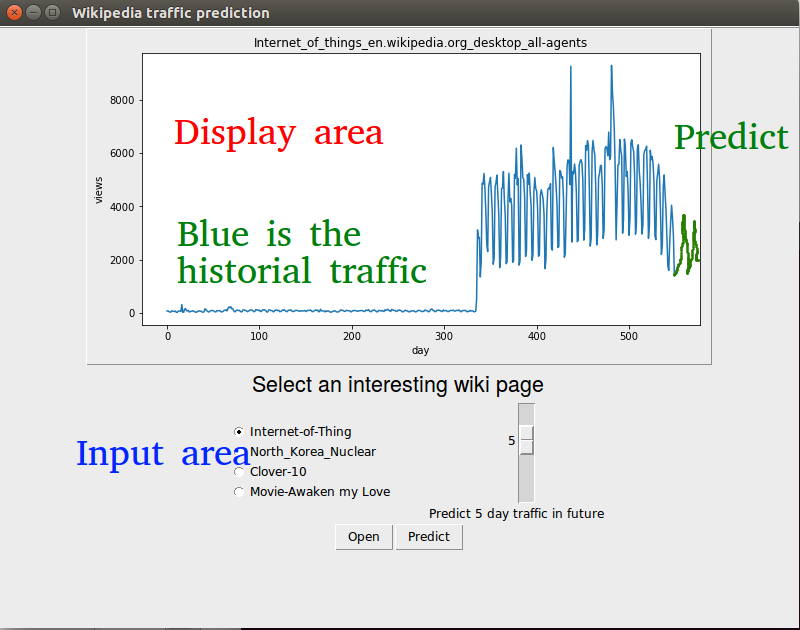

# CSCE636 Nueral Network Final project demo mockup

**Topic: Web Traffic Time Series Forecasting**

-- Chih-Peng Wu, 221000528

Youtube link: https://youtu.be/G3Aeayh6--w

## Execution of GUI

```python3 gui.py```

## Introduction
The web traffic time series forecasting competition is on [Kaggle](https://www.kaggle.com/c/web-traffic-time-series-forecasting).
The training data has over 145k wikipedia pages associated with traffic of 551 days.
The prediction objective is given an user-interested page, predict the next day traffic.

## The GUI functionality
Following is a screenshot of my GUI.


The GUI has two sections.
- Top section is display section, which shows the network traffic of the user-interested page, including both the historical and predicted traffic.
- The bottome section is input section, which allows users to input the traffic profiles, and predict the future traffic using my pre-trained model, and finally select interested page to display.

A simple step-by-step flow is:
1. An user open a file (.csv) as input
2. The pre-trained model generates prediction result based on the input, and display page names in the selection area (radio button).
3. The user can see the historical traffic in blue and prediction result in green.
4. If the input data consist the future traffic (i.e., test labels), then the display.
