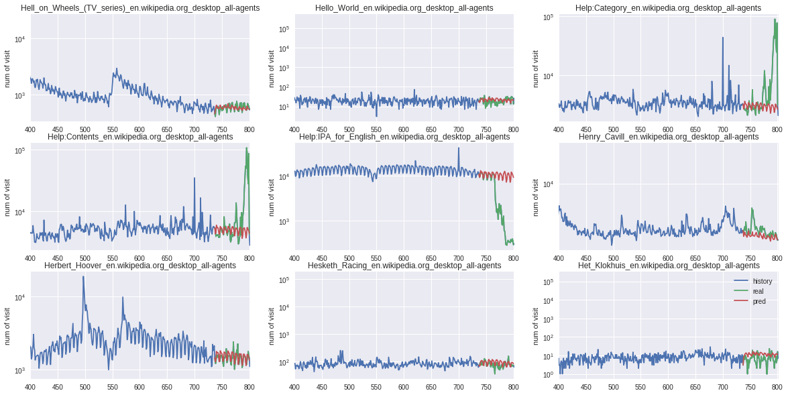

# CSCE636 Nueral Network Final project Demo

**Topic: Web Traffic Time Series Forecasting**

-- Chih-Peng Wu, 221000528

Youtube link: https://youtu.be/G3Aeayh6--w

## Topic and goal


The web traffic time series forecasting is a competition on [Kaggle](https://www.kaggle.com/c/web-traffic-time-series-forecasting).

### Dataset
The training data has over 145k wikipedia pages associated with traffic of 793 days.
The prediction objective is given an user-interested page, predict the next 63 days traffic.
- Training data from 2015-07-01 to 2017-09-01
- Testing data from 2017-09-10 to 2017-11-10

The dataset contains traffic history of:
- 7 languages
- 3 access (all, desktop, mobile-web)
- 2 types (all-agents, spider)

## DNN Model

### Architecture

My model is built using Keras sequential models.
There are 3 types of layers:
1. One Conv1D layer to extract nearby days information
2. Two Gated-Recurrent Unit (GRU) layers to learn the time-series patterns
3. Two Dense layers to consolidate the patterns and produce prediction

A snippet of code of constructing the model is shown as follow:
```
    model = Sequential()

    model.add(Conv1D(420, kernel_size=3, activation='relu'))
    model.add(AveragePooling1D(pool_size=2))
    model.add(GRU(210, activation='relu', input_shape=(n_timesteps, n_features), return_sequences=True))
    model.add(Dropout(rate=0.25))
    model.add(GRU(140, activation='relu', input_shape=(n_timesteps, n_features)))
    model.add(Dropout(rate=0.25))
    model.add(Dense(100, activation='relu'))
    model.add(Dense(n_outputs))
    model.compile(loss='mean_absolute_error', optimizer='adam')
```
### Model Summary
```
Layer (type)                 Output Shape              Param #   
=================================================================
conv1d_1 (Conv1D)            (None, 138, 420)          7980      
_________________________________________________________________
average_pooling1d_1 (Average (None, 69, 420)           0         
_________________________________________________________________
gru_1 (GRU)                  (None, 69, 210)           397530    
_________________________________________________________________
dropout_1 (Dropout)          (None, 69, 210)           0         
_________________________________________________________________
gru_2 (GRU)                  (None, 140)               147420    
_________________________________________________________________
dropout_2 (Dropout)          (None, 140)               0         
_________________________________________________________________
dense_1 (Dense)              (None, 100)               14100     
_________________________________________________________________
dense_2 (Dense)              (None, 63)                6363      
=================================================================
Total params: 573,393
```

### Input: Shape of Tensor
trainX shape is (n, 140, 6)
testX shape is (n, 140, 6)

### Output: Shape of Tensor
trainY shape is (n, 63)
testY shape is (n, 63)

### Shape Output Tensor for Each Layer

## Execution of GUI

Simply execute the python program

```python3 gui.py```


## The GUI functionality
Following is a screenshot of my GUI.


The GUI has two sections.
- Top section is display section, which shows the network traffic of the user-interested page, including both the historical and predicted traffic.
- The bottome section is input section, which allows users to input the traffic profiles, and predict the future traffic using my pre-trained model, and finally select interested page to display.

A simple step-by-step flow is:
1. An user open a file (.csv) as input
2. The pre-trained model generates prediction result based on the input, and display page names in the selection area (radio button).
3. The user can see the historical traffic in blue, the real traffic result in green and prediction result in red.
